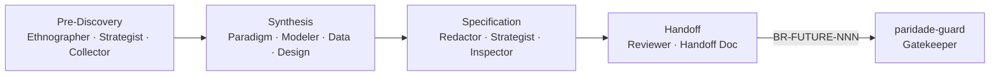

# Visa — Forward Spec Discovery for AI Agents

<small>by [Adgmed2018](https://github.com/Adgmed2018)</small>

**Transformando conversas vagas em especificações executáveis e verificáveis.**

[](https://pypi.org/project/visa-sdd/)
[](https://pypi.org/project/visa-sdd/)
[](LICENSE)
[](https://docs.astral.sh/ruff/)
[](https://mypy.readthedocs.io/)
[](tests/)
[](docs/verification/v1.4.0/)
[](docs/closed-loop.md)

---

## TL;DR

> A Visa é o **espelho à frente do Reversa** — enquanto o Reversa analisa código legado, a Visa descobre especificações *antes* de qualquer código ser escrito.

```bash
pip install visa-sdd
cd meu-projeto && touch CLAUDE.md
visa install                # instala 14 skills no agente de codificação
# /visa em Claude Code, Cursor, Codex ou Gemini CLI
```

---

## How it Works



Os 14 agentes são instalados como skills no seu agente de codificação. Eles produzem artefatos canônicos com IDs versionados (`BR-FUTURE-NNN`, `AMB-FUTURE-NNN`) que são consumidos pelo `paridade-guard ≥ 0.3.0` para fechar o ciclo SDD.

---

## Quick Start (5 min)

1. **Instale e inicialize:**
   ```bash
   pip install visa-sdd
   mkdir meu-projeto && cd meu-projeto
   touch CLAUDE.md            # marca engine = Claude Code
   visa install
   ```

2. **Abra o agente** (Claude Code, Cursor, Codex, Gemini CLI) na pasta e rode `/visa`. O orquestrador convoca os 14 agentes em sequência, gerando artefatos em `_visa_sdd/`.

3. **Valide e faça bridge:**
   ```bash
   visa validate              # checa que todos os 14 artefatos existem
   visa bridge                # gera stub canônico p/ paridade-guard
   ```

Tutorial completo em [docs/quickstart.md](docs/quickstart.md).

---

## CLI at a Glance

| Comando | Função | Exit codes |
|---|---|---|
| `visa install` | Instala 14 skills no projeto | 0 ok, 1 erro |
| `visa status` | Mostra estado atual | 0 instalado, 1 não |
| `visa validate` | Verifica artefatos esperados | 0 ok, 2 incompleto |
| `visa bridge` | Cria stub p/ paridade-guard | 0 ok, 2 incompleto, 3 lacuna |
| `visa uninstall` | Remove skills (preserva `_visa_sdd/`) | 0 ok |

`--accept-all-risks "motivo"` em `bridge` libera o gate do Coletor com auditoria.

---

## The 14 Agents

| Time | Agentes |
|---|---|
| **Orquestrador** | `visa` |
| **Pré-Descoberta** | `visa-etnografo` · `visa-estrategista` · `visa-coletor` |
| **Síntese** | `visa-paradigm-advisor` · `visa-modelador` · `visa-data-modeler` · `visa-design-system` |
| **Spec** | `visa-redator` · `visa-strategist` · `visa-inspector` |
| **Handoff** | `visa-revisor` · `visa-handoff` |
| **Utilitário** | `visa-agents-help` |

Detalhes e analogias com Reversa em [docs/agents.md](docs/agents.md).

---

## Comparison

| Recurso | Visa | Cursor | Aider | Cline | Kiro | Spec Kit | Reversa |
|---|---|---|---|---|---|---|---|
| Forward SDD (pré-código) | ✅ | ❌ | ❌ | ❌ | ⚠️ | ⚠️ | ❌ |
| Reverse SDD (legado) | ❌ | ❌ | ❌ | ❌ | ❌ | ❌ | ✅ |
| Closed Loop (gatekeeper) | ✅ | ❌ | ❌ | ❌ | ❌ | ❌ | ✅ |
| Canonical IDs versionados | ✅ | ❌ | ❌ | ❌ | ❌ | ❌ | ✅ |
| Multi-engine (4 IDEs) | ✅ | só Cursor | terminal | só VS Code | proprietário | proprietário | ✅ |
| Stdlib only (zero deps) | ✅ | n/a | ❌ | ❌ | n/a | n/a | n/a |
| Open source MIT | ✅ | ❌ | ✅ | ✅ | ❌ | ❌ | ✅ |

---

## Closed-Loop SDD

```
ideia → Visa (forward spec) → BR-FUTURE-NNN → paridade-guard → código verificado
                                                       ↑
                                          Reversa (de legado existente)
```

Detalhes em [docs/closed-loop.md](docs/closed-loop.md).

---

## Status

- **Versão atual:** v1.4.2 (Beta) — [CHANGELOG](CHANGELOG.md)
- **102 testes passando**, mypy strict zero erros, ruff zero warnings
- **Verification logs:** [docs/verification/v1.4.2/](docs/verification/v1.4.2/)
- **Limitações conhecidas:** [docs/limitations.md](docs/limitations.md)

---

## Documentação

- [docs/quickstart.md](docs/quickstart.md) — tutorial 5 min
- [docs/agents.md](docs/agents.md) — 14 agentes detalhados
- [docs/pipeline.md](docs/pipeline.md) — fluxo de descoberta
- [docs/canonical-format.md](docs/canonical-format.md) — schema YAML + IDs
- [docs/closed-loop.md](docs/closed-loop.md) — integração paridade-guard
- [docs/troubleshooting.md](docs/troubleshooting.md) — problemas comuns
- [docs/why-visa.md](docs/why-visa.md) — motivação e contexto
- [docs/limitations.md](docs/limitations.md) — transparência radical
- [docs/adr/](docs/adr/) — decisões arquiteturais

---

## Related Projects

- [Reversa](https://github.com/sandeco/reversa) — reverse SDD (espelho da Visa)
- [paridade-guard](https://github.com/Adgmed2018/paridade-guard) — gatekeeper

---

## Contributing & Security

- Issues e PRs: [CONTRIBUTING.md](CONTRIBUTING.md)
- Vulnerabilidades: [SECURITY.md](SECURITY.md)

---

## License

MIT © Adgmed2018
