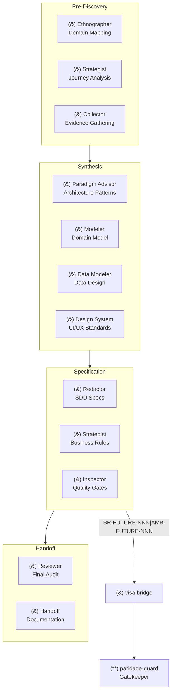
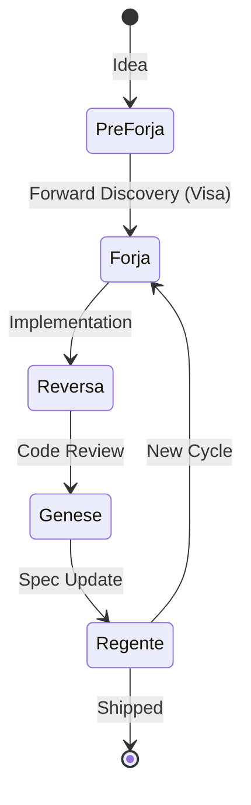
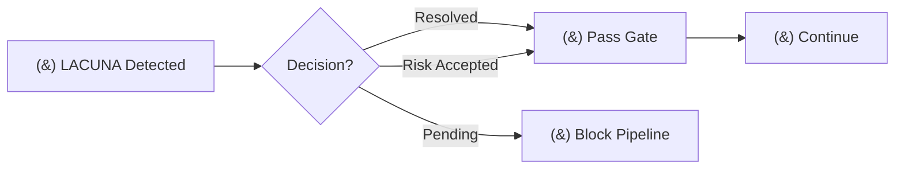
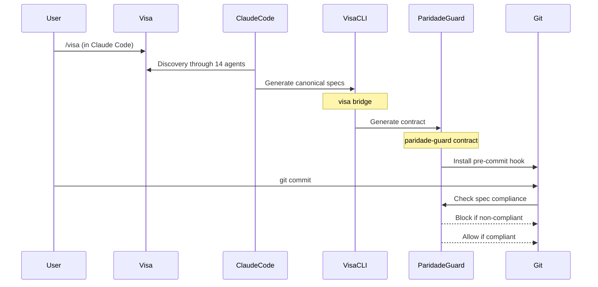

# Visa — Forward Spec Discovery for AI Agents

<small>by [Adgmed2018](https://github.com/Adgmed2018)</small>

**Transformando conversas vagas em especificações executáveis e verificáveis.**

[](https://pypi.org/project/visa-sdd/)
[](https://pypi.org/project/visa-sdd/)
[](LICENSE)
[](https://docs.astral.sh/ruff/)
[](https://mypy.readthedocs.io/)
[](tests/test_visa.py)
[](https://github.com/Adgmed2018/visa/actions)
[](https://pepy.tech/project/visa-sdd)
[](docs/pipeline.md)
[](https://x.com/Adgmed2018)

---

## TL;DR

> **A Visa é o espelho à frente do Reversa** — enquanto o Reversa analisa código legado, a Visa descobre especificações *antes* de qualquer código ser escrito.

```bash
# Install
pip install visa-sdd

# Initialize discovery pipeline
cd meu-projeto && touch CLAUDE.md
visa install

# Your AI agent now has 14 specialized agents for spec discovery
/visa  # Run in Claude Code, Cursor, etc.
```

---

## Architecture Overview



---

## Table of Contents

- [Background](#background)
- [Problem Statement](#problem-statement)
- [Core Concepts](#core-concepts)
- [Installation](#installation)
- [Quick Start](#quick-start)
- [CLI Reference](#cli-reference)
- [Canonical Output Format](#canonical-output-format)
- [Integration: Visa + paridade-guard](#integration-visa--paridade-guard)
- [Agents Overview](#agents-overview)
- [Limitations](#limitations)
- [Contributing](#contributing)
- [License](#license)

---

## Background

The AI-assisted coding ecosystem suffers from a deep **productivity illusion**. Prompt pipelines are inconsistent. "Magic" agents promise to create entire applications from a paragraph, but deliver fragile architectures, phantom files (that the LLM claims to have created but don't exist), and absolute lack of real auditability.

**Visa emerged from technical frustration with this lack of rigor.** It is incredibly difficult to transform informal conversations with Claude, GPT, or Codex into reliable, versionable artifacts that follow a logical pattern. The market focused on "writing code faster" instead of "ensuring we are building the correct system."

We needed a **verifiable software engineering system for AI agents** — a protocol that elevates requirements extraction to the same level of rigor as a CI/CD pipeline.

---

## Problem Statement

The Visa + paridade-guard duo attacks the main failure modes in LLM pipelines:

| Problem | Description |
|---------|-------------|
| **Structural Hallucinations** | Files that the LLM says it created (or modified), but don't actually exist in the repository. |
| **Spec-Code Divergence** | The gap between what was described and what is actually delivered during implementation. |
| **Lack of Traceability** | Inability to justify why a technical decision was made three weeks after the original chat. |
| **Inconsistency at Scale** | Difficulty maintaining context when orchestrating multiple agents throughout the lifecycle. |
| **No Canonical Format** | Lack of a reliable, deterministic contract for transit between requirements generation and code validation. |
| **Phantom Tests** | When AI claims tests are passing without ever running a real test runner. |
| **Evolution Barrier** | Massive barrier to migrate from "magic" disposable prompts to real software engineering processes with LLMs. |

---

## Core Concepts

### Spec-Driven Development (SDD)

SDD is a development methodology with a **closed feedback loop**:



### Canonical IDs

Every specification has a **canonical ID** for traceability:

| Prefix | Meaning | Example |
|--------|---------|---------|
| `BR-FUTURE-NNN` | Business rule to implement | `BR-FUTURE-001` |
| `BR-DESCARTAR-NNN` | Deliberate non-implementation | `BR-DESCARTAR-001` |
| `BR-HUMANA-NNN` | Human decision | `BR-HUMANA-001` |
| `AMB-FUTURE-NNN` | Ambiguity to resolve | `AMB-FUTURE-001` |
| `LACUNA-NNN` | Evidence gap requiring validation | `LACUNA-001` |

### Collector Gate

The **Collector Gate** is a computational gate that **blocks the pipeline** without evidence:



---

## Installation

### Via pip

```bash
# Install Visa (stdlib pure)
pip install visa-sdd

# Optional: Install paridade-guard for end-to-end validation
pip install paridade-guard>=0.3.0
```

### From Source

```bash
git clone https://github.com/Adgmed2018/visa.git
cd visa
pip install -e .
```

### Verify Installation

```bash
visa --version
# visa 1.3.0

visa status
#═ Visa — status ═
```

---

## Quick Start

### Demo: 5-Minute Cycle (No LLM Required)

```bash
# 1. Setup
mkdir demo-sdd && cd demo-sdd && touch CLAUDE.md
visa install

# 2. Simulate canonical output (as if discovery had occurred)
cat > _visa_sdd/business_model.md <<'EOF'
---
schemaVersion: 1
kind: target_business_rules
producedBy: visa-redator
---

# Target Business Rules

## Regras IMPLEMENTAR

### BR-FUTURE-001
- **Origem**: `_visa_sdd/evidence_results/lac-001.md`
- **Confiança**: 🟢
- **Descrição**: CRM validation before scheduling
- **Justificativa**: Evidence from 5 specialists
EOF

# 3. Validate structure
visa validate --strict
# → ✅ Structural validation passed.

# 4. Bridge to implementation gate
visa bridge
# → 🌉 Symlinks generated

# 5. paridade-guard generates contract
paridade-guard contract \
  --migration-dir _visa_sdd/migration \
  --output _visa_sdd/parity_audit/contract.json

# 6. Activate gate
paridade-guard install --pre-commit
```

### Full Discovery Cycle

```bash
# 1. Initialize
visa install

# 2. Open your AI coding agent (Claude Code, Cursor, etc.)
#    and type:
/visa

# 3. Follow the orchestration through agents:
#    Ethnographer → Strategist → Collector → Modeler → Redactor

# 4. Validate pipeline completion
visa validate --strict

# 5. Bridge to paridade-guard
visa bridge

# 6. Activate code gate
paridade-guard install --pre-commit
```

---

## CLI Reference

```text
usage: visa [-h] [--project-root PROJECT_ROOT] [--version]
            {install,status,validate,bridge,uninstall}

Visa — Forward Spec Discovery for AI Agents

optional arguments:
  -h, --help            show this help message and exit
  --project-root        Project root (default: cwd)
  --version             show program version

commands:
  install               Install Visa skills in project
  status                Show discovery status
  validate              Validate _visa_sdd/ artifacts
  bridge                Bridge to paridade-guard
  uninstall             Remove Visa from project
```

### Commands

| Command | Description | Exit Code |
|---------|-------------|-----------|
| `visa install` | Install skills and create `.visa/` state | 0 |
| `visa status` | Show discovery progress | 0 / 1 |
| `visa validate` | Check artifact presence | 0 / 2 |
| `visa validate --strict` | Validate canonical format | 0 / 3 |
| `visa bridge` | Build bridge + run Collector Gate | 0 / 2 / 4 |
| `visa uninstall --yes` | Remove Visa silently | 0 |
| `visa uninstall --purge` | Remove Visa + `_visa_sdd/` | 0 |

### Exit Codes

| Code | Meaning |
|------|---------|
| `0` | Success |
| `1` | Visa not installed / general error |
| `2` | Missing required artifacts |
| `3` | Canonical format validation failed |
| `4` | Collector Gate blocked (unresolved LACUNAs) |

---

## Canonical Output Format

```text
_visa_sdd/
├── landscape.md              # Ethnographic view
├── gaps.md                  # LACUNA management (Collector Gate)
├── evidence_plans/           # Forced evidence collection plans
├── evidence_results/         # Collected empirical data
├── business_model.md        # [CANONICAL] Target Business Rules
├── discard_log.md           # [CANONICAL] Deliberate non-implementation
├── ambiguity_log.md         # [CANONICAL] Uncertainty log
├── confidence-report.md     # [CANONICAL] Paradigm decision
├── sdd/                     # Deep dive documentation by component
└── migration/               # [BRIDGE] Symlinks to paridade-guard
```

### Front-Matter Schema

```yaml
---
schemaVersion: 1
kind: target_business_rules      # or: discard_log, ambiguity_log, paradigm_decision
producedBy: visa-redator        # or: visa-revisor, visa-strategist
timestamp: 2025-01-15T10:30:00Z
---
```

---

## Integration: Visa + paridade-guard



---

## Agents Overview

| # | Agent | Role | Confidence Scale |
|---|-------|------|-----------------|
| 1 | `visa` | Orchestrator | 🟢🟡🔴 |
| 2 | `visa-etnografo` | Domain mapping | 🟢🟡🔴 |
| 3 | `visa-estrategista` | Journey analysis | 🟢🟡🔴 |
| 4 | `visa-coletor` | Evidence auditor | 🟢🟡🔴 |
| 5 | `visa-paradigm-advisor` | Architecture patterns | 🟢🟡 |
| 6 | `visa-modelador` | Domain model | 🟢🟡 |
| 7 | `visa-data-modeler` | Data design | 🟢🟡 |
| 8 | `visa-design-system` | UI/UX standards | 🟢🟡 |
| 9 | `visa-redator` | SDD specs | 🟢🟡🔴 |
| 10 | `visa-strategist` | Business rules | 🟢🟡🔴 |
| 11 | `visa-inspector` | Quality gates | 🟢🟡 |
| 12 | `visa-revisor` | Final audit | 🟢🟡🔴 |
| 13 | `visa-handoff` | Documentation | 🟢🟡 |
| 14 | `visa-agents-help` | Help system | 🟢 |

### Confidence Scale

| Symbol | Meaning | Action |
|--------|---------|--------|
| 🟢 | High confidence | Proceed |
| 🟡 | Medium confidence | Validate with evidence |
| 🔴 | Low confidence | Block until evidence collected |

---

## Limitations

We are devoted to pragmatic, honest software engineering. Know the architectural limitations:

| Limitation | Impact | Mitigation |
|-----------|--------|------------|
| **Regex-based LACUNA Detection** | The Collector Gate (`visa bridge`) audits `gaps.md` using regex. Heavy modifications to generated format may temporarily break the lock. | Maintain canonical format from Redactor v1.1+ |
| **Silent Failure with Undisciplined LLMs** | Visa doesn't run models; it injects local skills. Low-capacity models may produce invalid Markdown that fails in `visa validate --strict`. | Use capable models (Claude, GPT-4 class) |
| **Passive Static Analysis** | `paridade-guard` doesn't run code. It works via static inspection on `git diff`. Doesn't exempt running unit tests. | Always run TDD alongside |

---

## Contributing

See [CONTRIBUTING.md](CONTRIBUTING.md) for details.

**Key principles:**
- ✅ **100% stdlib** — No third-party dependencies
- ✅ **40+ passing tests** — Maintain test coverage
- ✅ **Collector Gate integrity** — Evidence requirements are sacred
- ❌ **No external libraries** — stdlib purity is non-negotiable

---

## Security

See [SECURITY.md](SECURITY.md) for vulnerability reporting.

---

## Related Projects

| Project | Description |
|---------|-------------|
| [reversa](https://github.com/sandeco/reversa) | Reverse Spec Discovery — code to specs |
| [paridade-guard](https://github.com/Adgmed2018/paridade-guard) | Gatekeeper — spec compliance validator |
| [trindade](https://github.com/Adgmed2018/trindade-platform) | SDD CLI platform |
| [ciclo-sdd](https://github.com/Adgmed2018/ciclo-sdd) | Closed-loop SDD ecosystem |

---

## License

MIT — see [LICENSE](LICENSE) for details. Knowledge belongs to the ecosystem.

---

<p align="center">
  <strong>Built with rigor. Shipped with confidence.</strong>
</p>
