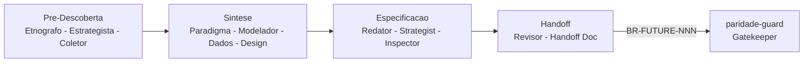

# Visa — A ferramenta operacional de **EngIA**

<small>by [Adgmed2018](https://github.com/Adgmed2018) · [English version](README.en.md)</small>

> **Spec é software. E software exige engenharia.**
>
> A Visa transforma conversas vagas em especificações executáveis e verificáveis — *antes* de qualquer linha de código existir.

[](https://pypi.org/project/visa-sdd/)
[](https://pypi.org/project/visa-sdd/)
[](LICENSE)
[](https://docs.astral.sh/ruff/)
[](https://mypy.readthedocs.io/)
[](tests/)
[](docs/verification/v1.4.0/)
[](docs/closed-loop.md)

---

## TL;DR

**A Visa é a peça *forward* do ciclo de Engenharia com IA (EngIA).**
Onde o [Reversa](https://github.com/sandeco/reversa) documenta código legado existente (olhar para trás), a Visa **descobre** a especificação do produto novo *antes* de existir código (olhar para frente). Os dois juntos, com o `paridade-guard` no meio, formam o único **ciclo SDD fechado** open-source no mercado em PT-BR.

```bash
pip install visa-sdd
cd meu-projeto && touch CLAUDE.md   # ou ANTIGRAVITY.md, AGENTS.md, .cursorrules, GEMINI.md, .windsurfrules
visa install                         # instala 14 skills no agente de codificação
# /visa em Claude Code, Antigravity, Codex, Cursor, Gemini CLI ou Windsurf
```

---

## Por que EngIA, e não "mais um AI coding tool"

O Vibe Coding morreu. Quem ficou só sentado pedindo "faça isso", "faça aquilo" para a IA, sem processo, descobriu — caro — que velocidade sem método não escala. **EngIA** (Engenharia de Software com IA) é o que substitui: **pensar antes**, especificar antes, validar antes. A Visa é o ferramental operacional dessa disciplina.

| Categoria errada | Categoria certa (a sua) |
|---|---|
| Cursor / Aider / Cline → *coding assistants* | Visa → **EngIA tooling: descoberta + spec + gate** |
| Jama / IBM DOORS / Polarion → spec governance humano | Visa → spec governance **para times com IA no loop** |

---

## Como funciona



Os 14 agentes são instalados como skills no seu agente de codificação. Eles produzem artefatos canônicos com IDs versionados (`BR-FUTURE-NNN`, `AMB-FUTURE-NNN`) consumidos pelo `paridade-guard >= 0.3.0` para fechar o ciclo SDD.

---

## Quick Start (5 min)

1. **Instale e inicialize:**
   ```bash
   pip install visa-sdd
   mkdir meu-projeto && cd meu-projeto
   touch CLAUDE.md            # marca engine = Claude Code
   visa install
   visa doctor                # NOVO v1.5.0 — diagnostico de instalacao
   ```

2. **Abra o agente** (Claude Code, Antigravity, Cursor, Codex, Gemini CLI ou Windsurf) na pasta e rode `/visa`. O orquestrador convoca os 14 agentes em sequencia, gerando artefatos em `_visa_sdd/`.

3. **Valide e faca bridge:**
   ```bash
   visa validate              # checa que todos os 14 artefatos existem
   visa bridge                # gera stub canonico p/ paridade-guard
   ```

Tutorial completo em [docs/quickstart.md](docs/quickstart.md).

---

## CLI

| Comando | Funcao | Exit codes |
|---|---|---|
| `visa install` | Instala 14 skills no projeto | 0 ok, 1 erro |
| `visa status` | Mostra estado atual | 0 instalado, 1 nao |
| `visa validate` | Verifica artefatos esperados | 0 ok, 2 incompleto |
| `visa bridge` | Cria stub p/ paridade-guard | 0 ok, 2 incompleto, 3 lacuna |
| `visa uninstall` | Remove skills (preserva `_visa_sdd/`) | 0 ok |
| **`visa doctor`** | **Diagnostico de instalacao (NOVO v1.5.0)** | 0 saudavel, 1 com avisos |
| **`visa upgrade`** | **Atualiza skills sem reinstalar (NOVO v1.5.0)** | 0 ok, 1 erro |

`--accept-all-risks "motivo"` em `bridge` libera o gate do Coletor com auditoria.

---

## Os 14 Agentes

| Time | Agentes |
|---|---|
| **Orquestrador** | `visa` |
| **Pre-Descoberta** | `visa-etnografo` - `visa-estrategista` - `visa-coletor` |
| **Sintese** | `visa-paradigm-advisor` - `visa-modelador` - `visa-data-modeler` - `visa-design-system` |
| **Spec** | `visa-redator` - `visa-strategist` - `visa-inspector` |
| **Handoff** | `visa-revisor` - `visa-handoff` |
| **Utilitario** | `visa-agents-help` - `visa-claude-md-builder` (NOVO v1.5.0) |

Detalhes e analogias com Reversa em [docs/agents.md](docs/agents.md).

---

## Comparacao na categoria correta

| Recurso | **Visa** | Reversa | Spec Kit | Jama / DOORS | Cursor / Aider |
|---|---|---|---|---|---|
| Forward Spec Discovery (pre-codigo) | OK | NAO | parcial | NAO | NAO |
| Reverse Spec (legado) | NAO | OK | NAO | parcial | NAO |
| Closed Loop com gatekeeper | OK | OK | NAO | NAO | NAO |
| Canonical IDs versionados (`BR-FUTURE-NNN`) | OK | OK | NAO | OK humano | NAO |
| Multi-engine IDE (6 IDEs) | OK | OK | so GH Copilot | n/a | so ele mesmo |
| Stdlib only (zero deps) | OK | n/a | NAO | n/a | NAO |
| Open source MIT | OK | OK | OK | NAO | NAO |
| Categoria correta | **EngIA tooling** | EngIA tooling | Spec authoring | Spec governance humano | Coding assistant |

---

## IDEs/Engines suportadas

| Engine | Entry file | Status |
|---|---|---|
| Claude Code | `CLAUDE.md` | es