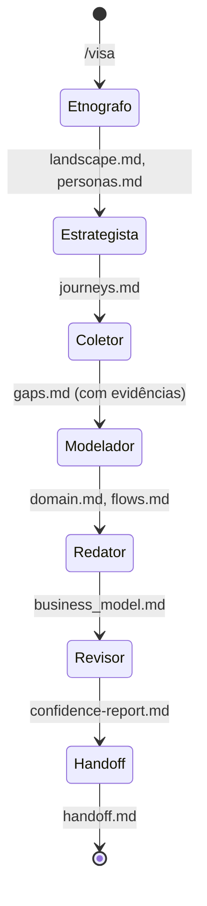

# ADR-0004: Multi-Agent Orchestration Architecture

## Status

**Accepted** — v1.0.0

## Context

A Visa orquestra **14 agentes especializados** para descobrir especificações. Cada agente tem responsabilidade única e expertise limitada.

**Desafios**:
1. **Orquestração** — como agents se comunicam
2. **Estado** — como manter contexto entre agents
3. **Confiança** — como escalonar evidência
4. **Convergência** — como chegar a spec final

**Alternativas Considered**:
1. **Monolito** — um único prompt com todas as instruções (prompts longos, LLM confuso)
2. **Sequencial rígido** — cada agent espera anterior (ineficiente)
3. **Orquestrador + Especialistas** — Agent central delega (escolhido)

## Decision

**Arquitetura Orquestrador + 13 Especialistas com pipeline Discovery → Synthesis → Spec → Handoff.**

### Estrutura de Agentes

```
visa (Orquestrador)
├── Time de Descoberta (Pre-Discovery)
│   ├── visa-etnografo      # Domain mapping
│   ├── visa-estrategista  # Journey analysis
│   └── visa-coletor       # Evidence auditor 🟢🟡🔴
│
├── Time de Síntese (Synthesis)
│   ├── visa-paradigm-advisor  # Architecture patterns
│   ├── visa-modelador         # Domain model
│   ├── visa-data-modeler     # Data design
│   └── visa-design-system    # UI/UX standards
│
├── Time de Spec (Specification)
│   ├── visa-redator      # SDD specs (🟢🟡🔴)
│   ├── visa-strategist   # Business rules (🟢🟡🔴)
│   └── visa-inspector     # Quality gates
│
└── Time de Handoff
    ├── visa-revisor    # Final audit (🟢🟡🔴)
    └── visa-handoff    # Documentation
```

### Roles por Confiança

| Confiança | Agents | Significado |
|-----------|--------|-------------|
| 🟢 Alta | Coletor, Redator, Strategist, Revisor | Alta evidência, prosseguir |
| 🟡 Média | Etnógrafo, Estrategista, Modelador | Precisa validação |
| 🔴 Baixa | (em geral) | Bloquear pipeline |

### Comunicação

1. **Orquestrador → Especialista**: Injeta SKILL.md no contexto
2. **Especialista → Estado**: Escreve em `_visa_sdd/` para próxima fase
3. **Estado → Orquestrador**: Lê output para decisão de gate

### Padrão de Iteração



## Consequences

### Positive
- ✅ **Separação de responsabilidades** — cada agent é especialista
- ✅ **Contexto份** — agentes não precisam guardar estado global
- ✅ **Debuggabilidade** — cada fase é auditável via artefatos
- ✅ **Escalabilidade** — novos agents são adicionáveis

### Negative
- ❌ **Latência** — múltiplas rodadas de LLM
- ❌ **Custo** — tokens por agente
- ❌ **Complexidade** — 14 SKILL.md para manter

### Mitigations
- Agents podem rodar em paralelo (descoberta: etnografo + estrategista)
- Artefatos intermediários permitem resumir mid-discovery
- Cache de contexto reduz re-tokenização

## References

- [visa/SKILL.md](https://github.com/Adgmed2018/visa/blob/main/agents/visa/SKILL.md)
- [reversa architecture](https://github.com/sandeco/reversa)
