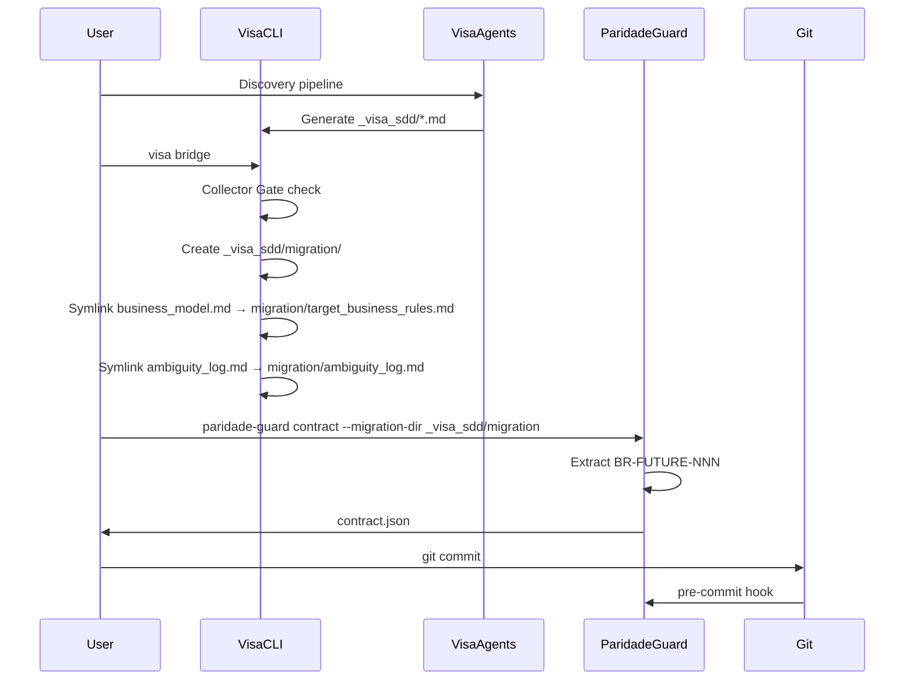

# ADR-0005: Bridge Pattern for paridade-guard Integration

## Status

**Accepted** — v1.1.0

## Context

A Visa gera artefatos canônicos em `_visa_sdd/`, mas o paridade-guard espera arquivos em formato específico (`_reversa_sdd/migration/`).

**Problema histórico (v1.0)**:
- `visa bridge` copiava arquivos para `_reversa_sdd/migration/`
- Renomeava arquivos para matchear naming do paridade-guard
- Resultado: contrato com 1 cláusula sintética em vez das regras reais
- Causa: artefatos da Visa não seguiam padrão `### BR-MIGRAR-NNN`

**Insight**: Não precisamos copiar/renomear. O paridade-guard ≥ 0.3.0 entende artefatos forward nativamente.

## Decision

**`visa bridge` cria stub apontando diretamente para `_visa_sdd/`, não copia artefatos.**

### v1.0 vs v1.1

| Aspecto | v1.0 | v1.1+ |
|---------|------|-------|
| Stub location | `_reversa_sdd/migration/` | `_visa_sdd/migration/` |
| Strategy | Copiar + renomear | Symlink direto |
| Artefatos | Copiados | Apontados |
| Contract | Sintético (1 cláusula) | Real (todas as regras) |

### Implementação

```python
def cmd_bridge(args) -> int:
    # ...
    migration_stub = visa_dir / "migration"
    migration_stub.mkdir(exist_ok=True)

    # Mapeamento: nome Visa → nome esperado pelo guard
    dst_name_map = {
        "business_model.md": "target_business_rules.md",
        "discard_log.md": "discard_log.md",
        "ambiguity_log.md": "ambiguity_log.md",
        "confidence-report.md": "paradigm_decision.md",
    }

    for fname in canonical_artifacts:
        src = visa_dir / fname
        if not src.exists():
            continue
        dst = migration_stub / dst_name_map[fname]
        # Symlink ou cópia (fallback Windows)
        try:
            dst.symlink_to(src.resolve())
        except (OSError, NotImplementedError):
            shutil.copy2(src, dst)
```

### Fluxo Completo



## Consequences

### Positive
- ✅ **Contrato real** — todas as regras extraídas corretamente
- ✅ **Zero duplicação** — não copiamos arquivos
- ✅ **Consistência** — artefatos ficam em `_visa_sdd/` (single source of truth)
- ✅ **Windows compat** — symlink com fallback para cópia

### Negative
- ❌ `_visa_sdd/migration/` pode confundir (parece duplicação)
- ❌ paridade-guard ≥ 0.3.0 obrigatório ( Breaking Change)

### Mitigations
- Mensagem informativa no CLI explicando propósito de `migration/`
- Verificação de versão do paridade-guard no bridge

## References

- [paridade-guard ≥ 0.3.0](https://github.com/Adgmed2018/paridade-guard)
- [CLI bridge implementation](https://github.com/Adgmed2018/visa/blob/main/src/visa_sdd/cli.py)
