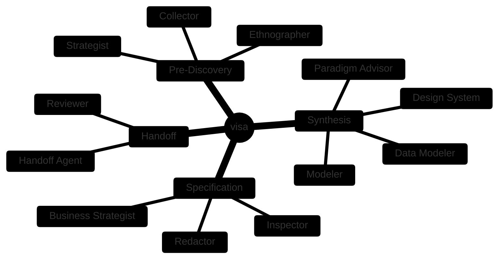
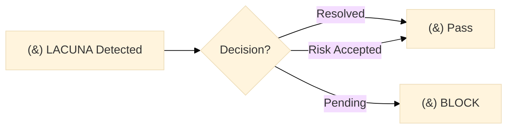

# Visa Agents — Reference Guide

Este documento detalha os 14 agentes especializados da Visa.

## Visão Geral

## Orquestrador

### visa (Orquestrador)

**Arquivo**: `agents/visa/SKILL.md`

**Responsabilidade**: Controla o avanço do pipeline e policia a escala de evidências (🟢🟡🔴).

**Entrada**: Plano de descoberta, checkpoint atual
**Saída**: Orquestração de agentes específicos

**Escala de Confiança**:
| Nível | Significado |
|-------|-------------|
| 🟢 | Alta evidência, prosseguir |
| 🟡 | Precisa validação, continuar com cautela |
| 🔴 | Bloquear até evidência собрана |

---

## Time de Descoberta

### visa-etnografo

**Arquivo**: `agents/visa-etnografo/SKILL.md`

**Responsabilidade**: Mapeia o domínio de alto nível, identifica personas e constrói o glossário.

**Entrada**: Conversa informal com stakeholders
**Saída**:
- `landscape.md` — Visão etnográfica do domínio
- `personas-inicial.md` — Personas identificadas
- `glossario.md` — Vocabulário do domínio

**Confiança**: 🟢🟡

---

### visa-estrategista

**Arquivo**: `agents/visa-estrategista/SKILL.md`

**Responsabilidade**: Cruza perfis com jornadas para isolar dores críticas.

**Entrada**: `landscape.md`, `personas.md`
**Saída**:
- `pains.md` — Dores identificadas
- `opportunities.md` — Oportunidades
- `concorrentes.md` — Análise competitiva

**Confiança**: 🟢🟡

---

### visa-coletor (Auditor)

**Arquivo**: `agents/visa-coletor/SKILL.md`

**Responsabilidade**: O auditor. Interrompe hipóteses vazias emitindo roteiros de validação reais.

**Entrada**: `pains.md`, `opportunities.md`
**Saída**:
- `gaps.md` — Lacunas de evidência (LACUNA-NNN)
- `evidence_plans/` — Planos de coleta
- `evidence_results/` — Resultados coletados

**⚠️ CRÍTICO**: Este agente TRAVA o pipeline se lacunas não forem resolvidas.

**Confiança**: 🟢🟡🔴

**Gate do Coletor**:

---

## Time de Síntese

### visa-paradigm-advisor

**Arquivo**: `agents/visa-paradigm-advisor/SKILL.md`

**Responsabilidade**: Recomenda padrões arquiteturais (Clean Architecture, DDD, etc.).

**Entrada**: `landscape.md`, `pains.md`
**Saída**:
- `confidence-report.md` (paradigm decision)

**Confiança**: 🟢🟡

---

### visa-modelador

**Arquivo**: `agents/visa-modelador/SKILL.md`

**Responsabilidade**: Constrói proposta de fluxos, arquitetura de software e design estrutural.

**Entrada**: `landscape.md`, `pains.md`, `evidence_results/`
**Saída**:
- `domain.md` — Modelo de domínio
- `flows.md` — Fluxos principais
- `architecture.md` — Arquitetura conceitual

**Confiança**: 🟢🟡

---

### visa-data-modeler

**Arquivo**: `agents/visa-data-modeler/SKILL.md`

**Responsabilidade**: Modelo de dados, schemas, integrações.

**Entrada**: `domain.md`
**Saída**:
- Data models
- `integrations.md` — Integrações

**Confiança**: 🟢🟡

---

### visa-design-system

**Arquivo**: `agents/visa-design-system/SKILL.md`

**Responsabilidade**: UI/UX standards, design tokens.

**Entrada**: `landscape.md`, `personas.md`
**Saída**:
- Design tokens
- UI patterns

**Confiança**: 🟢🟡

---

## Time de Especificação

### visa-redator (CRÍTICO)

**Arquivo**: `agents/visa-redator/SKILL.md`

**Responsabilidade**: Emite as especificações imutáveis com IDs únicos.

**Entrada**: `domain.md`, `flows.md`, `evidence_results/`
**Saída** (canônicos):
- `business_model.md` — BR-FUTURE-NNN
- `discard_log.md` — BR-DESCARTAR-NNN
- `ambiguity_log.md` — AMB-FUTURE-NNN

**⚠️ CRÍTICO**: Este agente gera os artefatos que o paridade-guard consome.

**Confiança**: 🟢🟡🔴

---

### visa-strategist

**Arquivo**: `agents/visa-strategist/SKILL.md`

**Responsabilidade**: Análise de estratégia de negócio, user stories.

**Entrada**: `pains.md`, `opportunities.md`
**Saída**:
- `user-stories.md`
- `sdd/*.md` — Especificações por componente

**Confiança**: 🟢🟡🔴

---

### visa-inspector

**Arquivo**: `agents/visa-inspector/SKILL.md`

**Responsabilidade**: Quality gates, validação de consistência.

**Entrada**: Todos os artefatos
**Saída**:
- Validation report
- Gaps de qualidade

**Confiança**: 🟢🟡

---

## Time de Handoff

### visa-revisor (CRÍTICO)

**Arquivo**: `agents/visa-revisor/SKILL.md`

**Responsabilidade**: Auditoria cruzada antes da consolidação do pacote.

**Entrada**: Todos os artefatos
**Saída**:
- `confidence-report.md` (final)
- Audit report

**Confiança**: 🟢🟡🔴

---

### visa-handoff

**Arquivo**: `agents/visa-handoff/SKILL.md`

**Responsabilidade**: Transforma documentação descoberta no formato de passagem de bastão.

**Entrada**: Todos os artefatos
**Saída**:
- `handoff.md` — Documento de handoff
- `openapi/` — OpenAPI specs (se aplicável)

**Confiança**: 🟢🟡

---

## Utilitário

### visa-agents-help

**Arquivo**: `agents/visa-agents-help/SKILL.md`

**Responsabilidade**: Help system para agents.

**Entrada**: Query
**Saída**: Help text

---

## Mapeamento Visa ↔ Reversa

| Visa Agent | Reversa Agent | Direção |
|------------|--------------|---------|
| `visa` | `reversa` | Forward ↔ Reverse |
| `visa-etnografo` | `reversa-scout` | Discovery ↔ Analysis |
| `visa-estrategista` | `reversa-archaeologist` | Strategy ↔ Archaeology |
| `visa-coletor` | `reversa-detective` | Evidence ↔ Investigation |
| `visa-paradigm-advisor` | `reversa-paradigm-advisor` | Paradigm ↔ Paradigm |
| `visa-modelador` | `reversa-architect` | Model ↔ Architecture |
| `visa-data-modeler` | `reversa-data-master` | Data Design ↔ Data |
| `visa-design-system` | `reversa-design-system` | Design ↔ Design |
| `visa-redator` | `reversa-writer` | Forward Spec ↔ Reverse Spec |
| `visa-revisor` | `reversa-reviewer` | Review ↔ Review |
| `visa-handoff` | `reversa-migrate` | Handoff ↔ Migration |

## Escala de Confiança — Detalhamento

| Símbolo | Nível | Ação |
|---------|-------|------|
| 🟢 | Alta | Prosseguir para próxima fase |
| 🟡 | Média | Continuar com cautela, requer validação |
| 🔴 | Baixa | **Bloquear pipeline** até evidência collectada |

### Critérios por Nível

**🟢 Alta Confiança**:
- 5+ fontes de evidência independentes
- Consenso entre especialistas
- Validação empírica

**🟡 Média Confiança**:
- 2-4 fontes de evidência
- Inferência plausível
- Validação parcial

**🔴 Baixa Confiança**:
- < 2 fontes de evidência
- Hipótese sem validação
- **Pipeline bloqueado**
