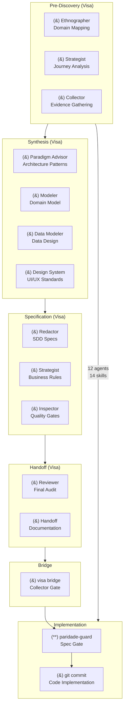
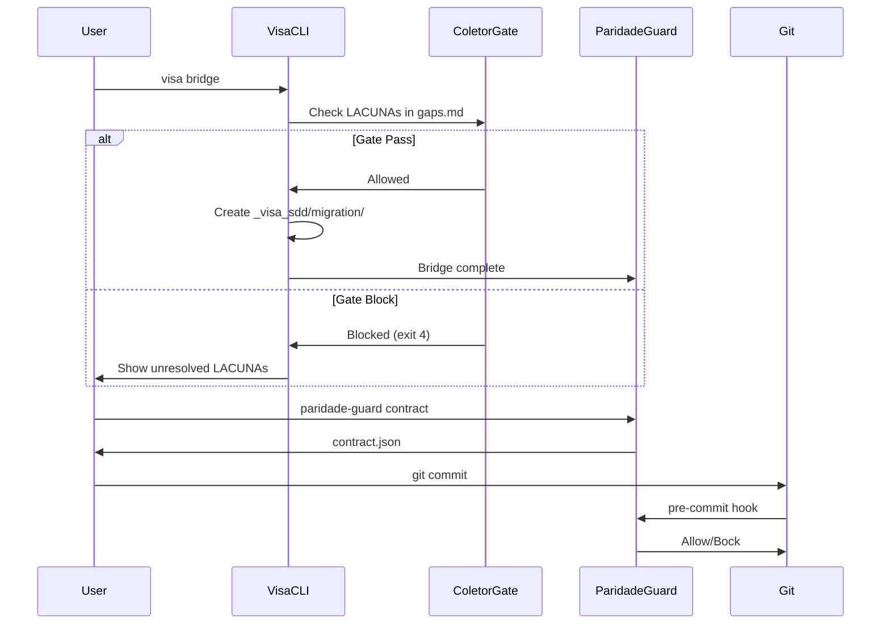
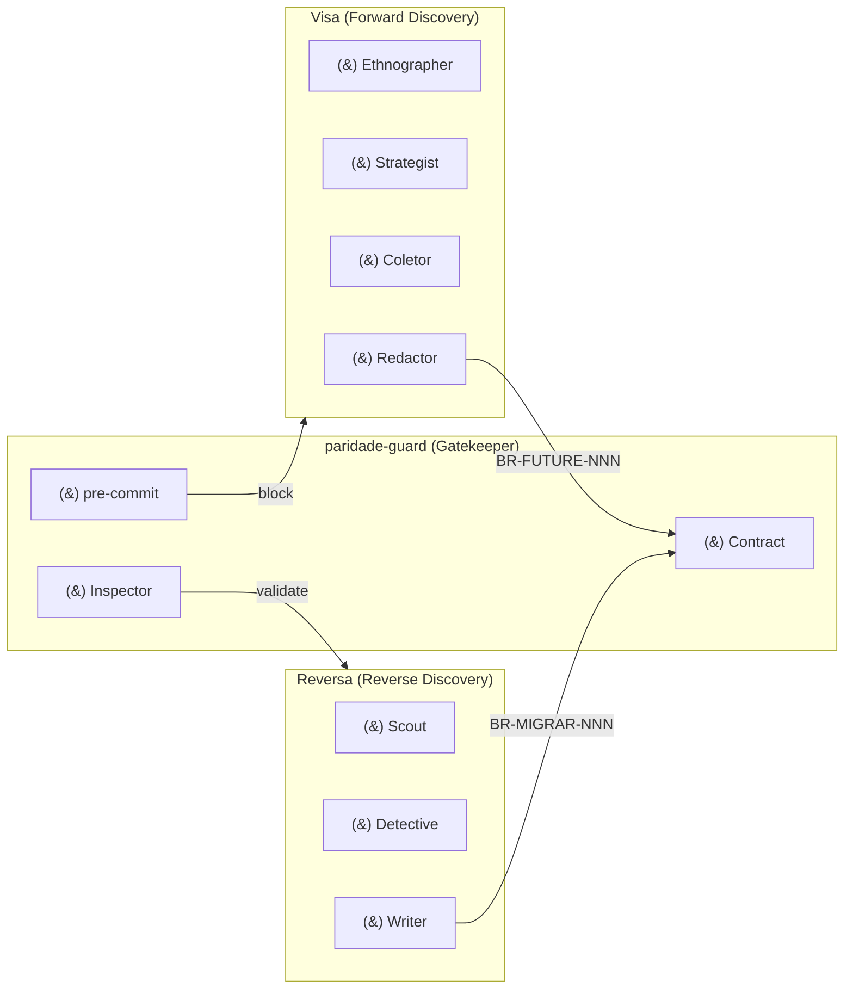

# SDD Pipeline — Ciclo Fechado de Desenvolvimento

Este documento descreve o pipeline completo de Spec-Driven Development (SDD) e como a Visa se integra ao ecossistema.

## Visão Geral



## Fases do Pipeline

### Fase 1: Pré-Descoberta (Visa)

| Agent | Output | Confiança |
|-------|--------|-----------|
| `visa-etnografo` | `landscape.md`, `personas.md`, `glossario.md` | 🟢🟡 |
| `visa-estrategista` | `pains.md`, `opportunities.md`, `concorrentes.md` | 🟢🟡 |
| `visa-coletor` | `gaps.md`, `evidence_plans/`, `evidence_results/` | 🟢🟡🔴 |

### Fase 2: Síntese (Visa)

| Agent | Output | Confiança |
|-------|--------|-----------|
| `visa-paradigm-advisor` | `confidence-report.md` (paradigm) | 🟢🟡 |
| `visa-modelador` | `domain.md`, `flows.md`, `architecture.md` | 🟢🟡 |
| `visa-data-modeler` | Data model, `integrations.md` | 🟢🟡 |
| `visa-design-system` | Design tokens, UI standards | 🟢🟡 |

### Fase 3: Especificação (Visa)

| Agent | Output | Confiança |
|-------|--------|-----------|
| `visa-redator` | `business_model.md`, `discard_log.md`, `ambiguity_log.md` | 🟢🟡🔴 |
| `visa-strategist` | `user-stories.md`, `sdd/*.md` | 🟢🟡🔴 |
| `visa-inspector` | Quality gates, validation | 🟢🟡 |

### Fase 4: Handoff (Visa)

| Agent | Output | Confiança |
|-------|--------|-----------|
| `visa-revisor` | `confidence-report.md` (final), audit | 🟢🟡🔴 |
| `visa-handoff` | `handoff.md`, `openapi/` | 🟢🟡 |

### Fase 5: Bridge



### Fase 6: Implementação Vigiada (paridade-guard)

O `paridade-guard` atua como gatekeeper no `pre-commit`:
- Lê `contract.json`
- Inspeca `git diff`
- Bloqueia commits que violem especificações

## Artefatos por Fase

```
_visa_sdd/
├── landscape.md              # Fase 1
├── personas-inicial.md      # Fase 1
├── glossario.md             # Fase 1
├── pains.md                 # Fase 1
├── opportunities.md         # Fase 1
├── gaps.md                  # Fase 1 (Coletor)
├── evidence_plans/          # Fase 1
├── evidence_results/        # Fase 1
├── evidence_scripts/       # Fase 1
│
├── domain.md                # Fase 2
├── flows.md                 # Fase 2
├── architecture.md          # Fase 2
├── integrations.md          # Fase 2
│
├── business_model.md        # Fase 3 [CANONICAL]
├── discard_log.md          # Fase 3 [CANONICAL]
├── ambiguity_log.md         # Fase 3 [CANONICAL]
├── confidence-report.md     # Fase 3 [CANONICAL]
├── user-stories.md         # Fase 3
├── sdd/                    # Fase 3
│
├── handoff.md              # Fase 4
│
└── parity_audit/           # Bridge
    └── contract.json       # paridade-guard
```

## Exit Codes

| Code | Significado | Ação |
|------|------------|------|
| `0` | Sucesso | Prosseguir |
| `1` | Erro geral | Verificar logs |
| `2` | Artefatos faltando | Completar pipeline |
| `3` | Formato inválido | Corrigir front-matter/IDs |
| `4` | Gate bloqueado | Resolver LACUNAs |

## Integração com Ecossistema



## Métricas de Qualidade

| Métrica | Target | Atual |
|---------|--------|-------|
| Cobertura de artefatos | 100% obrigatórios | 14/14 |
| Confiança média | 🟢 > 70% | 🟢🟡 |
| LACUNAs resolvidas | 100% antes de handoff | varies |
| Tests passing | 40/40 | ✅ |
| CI/CD coverage | 100% | ✅ |
